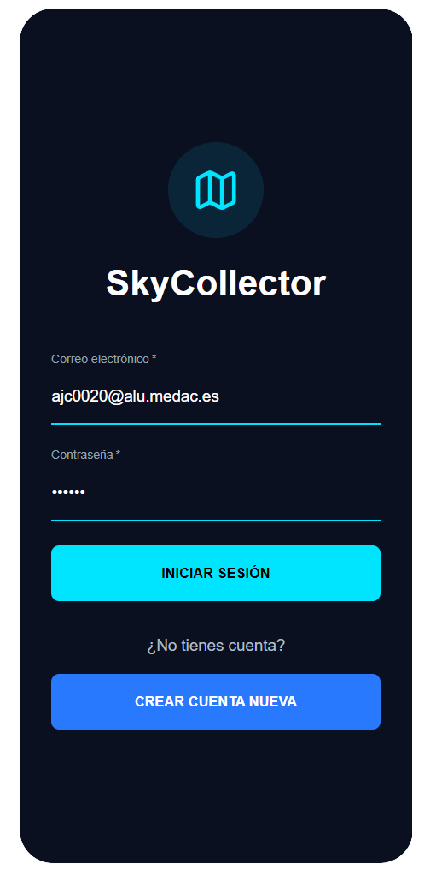
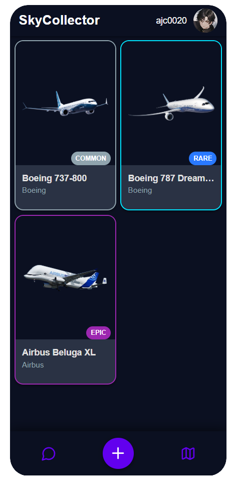
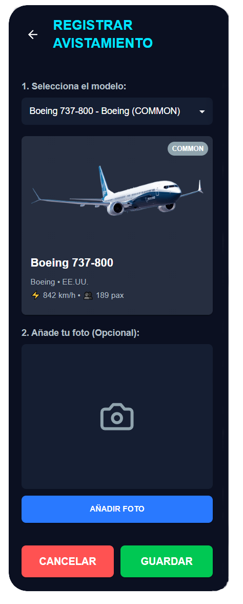
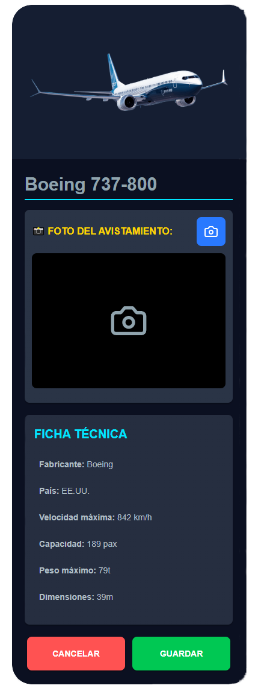
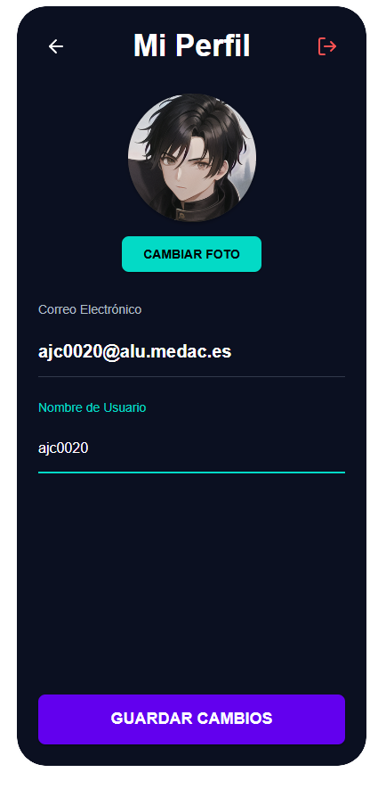
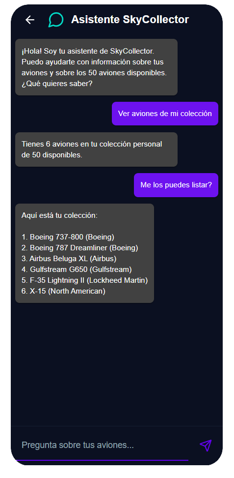
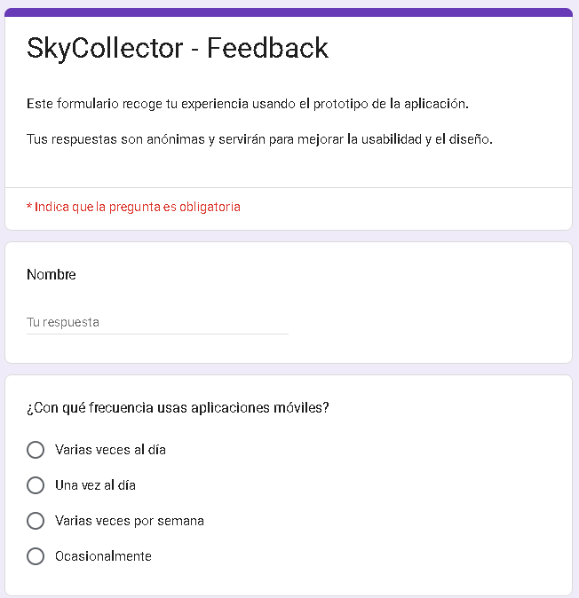
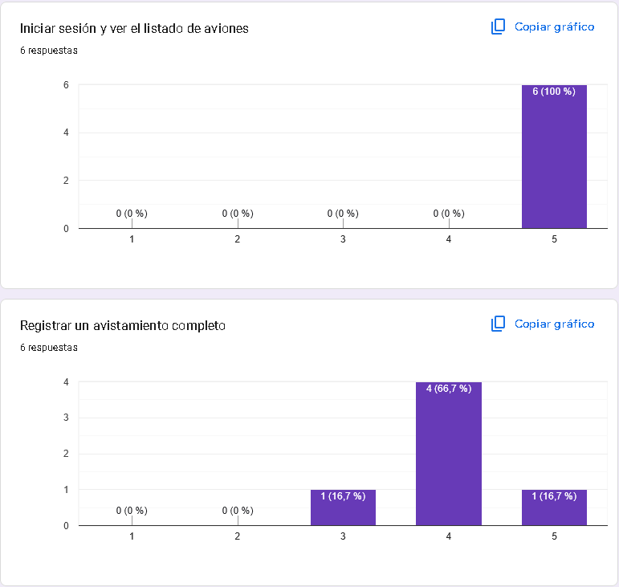

# ✈️ SkyCollector – Diseño UI/UX con pruebas y rediseño

      

Proyecto realizado para el módulo **Desarrollo de Interfaces**, centrado en el diseño de la interfaz gráfica, la experiencia de usuario y la mejora iterativa mediante pruebas reales.

---

## 🔗 Enlaces del proyecto

### Prototipado en Figma
- **Prototipo v1 (diseño inicial):**  
  https://attic-froze-16880795.figma.site
- **Prototipo v2 (diseño final mejorado):**  
  https://malt-easy-43617739.figma.site

### Presentación en Canva
- https://www.canva.com/design/DAHAz2c4FQA/Qzy9MLAS-Lw6a1nU65PRug/edit

### Enlace al Google Form
- https://forms.gle/a42kbaB4RF5ejABD9

---

## 🎯 Objetivo del proyecto

El objetivo de este proyecto es diseñar una aplicación Android centrada en la experiencia de usuario, aplicando principios profesionales de **Material Design**, usabilidad y accesibilidad. El diseño ha sido evaluado mediante pruebas reales con usuarios externos, permitiendo detectar problemas de interacción y mejorar la interfaz a través de un proceso de rediseño que evoluciona del prototipo inicial v1 a una versión final v2 más optimizada y coherente.

No se evalúa la programación interna de la aplicación, sino la calidad del diseño, la justificación de las decisiones tomadas y la capacidad de mejora a partir de pruebas reales.

---

## 📱 ¿Qué es SkyCollector?

SkyCollector es una aplicación Android dirigida a aficionados a la aviación que permite registrar y coleccionar avistamientos de aviones en la vida real. A través de una cuenta personal, el usuario puede añadir los aviones que ha visto, asociar fotografías reales de los avistamientos, consultar información técnica de cada modelo y comprobar su progreso dentro de la colección.

La aplicación se complementa con un **asistente con inteligencia artificial** y con un **mapa en tiempo real** basado en la API de OpenSky.

---

## 🧭 Descripción de las pantallas

### Pantalla de inicio de sesión
Permite al usuario iniciar sesión o crear una cuenta mediante correo electrónico y contraseña, con validaciones visuales que reducen la fricción inicial.



### Pantalla principal – Colección
Muestra la colección de aviones mediante tarjetas de estilo Material Design, identificando modelo y rareza mediante colores.



### Pantalla de registrar avistamiento
Permite añadir un nuevo avión seleccionando el modelo y añadiendo una fotografía desde la cámara o galería.



### Pantalla de detalles del avión
Muestra información completa del avión y separa claramente las acciones de guardar y volver.



### Pantalla de perfil de usuario
Permite gestionar los datos personales y cerrar sesión de forma clara.



### Pantalla de chat con IA
Integra un asistente con IA para consultar información sobre la colección.



---

## 🎨 Material Design y usabilidad

El diseño de SkyCollector aplica los principios de Material Design con una paleta de colores coherente, tipografía legible, iconografía Material y jerarquía visual clara. Los fondos oscuros reducen la fatiga visual y los colores vivos destacan acciones importantes y rarezas.

---

## 🧪 Pruebas de usabilidad

Las pruebas se realizaron sobre el prototipo v1 con usuarios externos utilizando Google Forms.




Se recogieron datos de tiempo por tarea, errores, ayuda necesaria y nivel de satisfacción.

---

## 🔁 Rediseño y mejoras (v1 → v2)

Entre las mejoras implementadas se incluyen:
- 50 imágenes PNG personalizadas
- Centrado y ajuste correcto de imágenes
- Bordes de color según rareza
- Botón de cerrar sesión
- Uso de cámara en avistamientos
- Separación de acciones guardar y volver

Estas mejoras dieron lugar al prototipo v2, más claro y coherente.

---

## 📁 Estructura del repositorio

```
/figma
/documentacion
/pruebas_usabilidad
/imagenes
README.md
```

---

## 👥 Autores

- **xSurfuel2**
- **Ivannovichh**

---

## ✅ Conclusión

SkyCollector demuestra un proceso completo de diseño UI/UX basado en Material Design, pruebas reales y rediseño iterativo, cumpliendo los requisitos del proyecto y ofreciendo una experiencia de usuario sólida y profesional.
